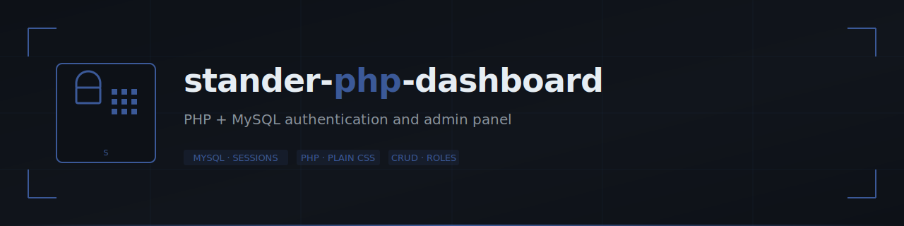
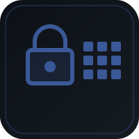
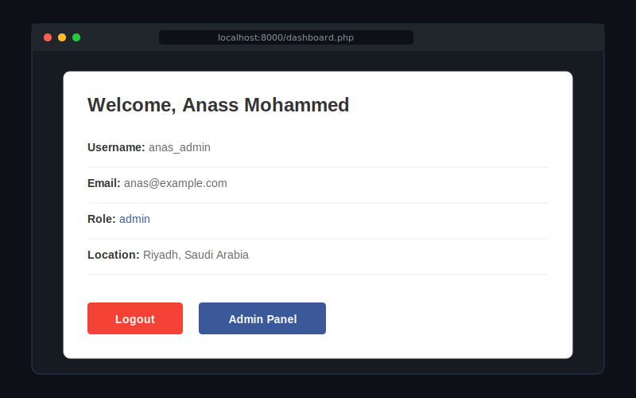
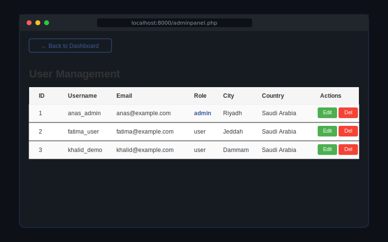
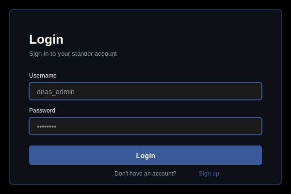
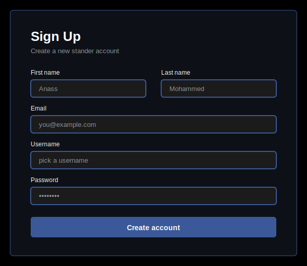

<p align="center">
  
</p>

<p align="center">
  
</p>

<h1 align="center">stander-php-dashboard</h1>

<p align="center">
  A small PHP + MySQL authentication and admin panel — built as my college final exam project for <strong>Web Programming &amp; Development</strong>.
</p>

<p align="center">
  
  
  
  
</p>

---

## About this submission

This project was built as the **final exam project** for the Web Programming & Development course. The goal was to demonstrate core backend fundamentals end-to-end: a complete user authentication flow plus an admin panel for managing users.

**Scope of the submission:**
- Signup, login, logout (session-based)
- Authenticated user dashboard with profile info
- Role-based access control (`user` / `admin`)
- Admin panel for listing, editing, and deleting users
- MySQL-backed persistence

The project focuses on the **core auth + admin features**. Production hardening (prepared statements, password hashing, CSRF tokens, rate limiting) is documented as future work — see [Security](#security) below.

---

## Screenshots

<p align="center">
  
</p>

<p align="center">
  <em>Logged-in dashboard view — shows the user's profile and action buttons.</em>
</p>

<br>

<p align="center">
  
</p>

<p align="center">
  <em>Admin panel — list of users with edit/delete actions. Visible only to users with the admin role.</em>
</p>

<br>

<p align="center">
  
  &nbsp;&nbsp;&nbsp;
  
</p>

<p align="center">
  <em>Login (left) and signup (right) forms, themed to match the project's dark blue palette.</em>
</p>

---

## Tech

- **PHP** — server-side logic, no framework
- **MySQL** (via `mysqli`) — persistence layer
- **Plain CSS** — single `style.css` shared across views, plus minimal inline styles
- **Sessions** — built-in PHP session handling for auth state
- **GitHub Actions** — `php -l` syntax check on every push to `main`

## Project structure

```
.
├── adminpanel.php       # User list + edit/delete actions (admin only)
├── dashboard.php        # Logged-in user profile view
├── db.php               # MySQL connection
├── delete.php           # User delete handler
├── edit.php             # User edit handler
├── index.php            # Landing / redirect
├── login.php            # Login form + handler
├── logout.php           # Logout handler
├── signup.php           # Signup form + handler
├── style.css            # Shared styles
├── websitesetp.php      # Initial DB + users table setup
├── docs/
│   ├── banner.svg
│   ├── logo.svg
│   ├── screenshot-dashboard.svg
│   ├── screenshot-admin.svg
│   ├── screenshot-login.svg
│   └── screenshot-signup.svg
├── .github/
│   └── workflows/
│       └── php.yml      # CI: php -l syntax check
├── .env.example
├── LICENSE
└── README.md
```

## Setup

1. **Create the database**

   ```sql
   CREATE DATABASE anasx;
   ```

   The app creates the `users` table automatically the first time you run it (via `websitesetp.php`).

2. **Configure credentials**

   Either edit `db.php` directly, or copy `.env.example` to `.env` and adjust to your environment:

   ```ini
   DB_HOST=localhost
   DB_USER=root
   DB_PASSWORD=
   DB_NAME=anasx
   ```

3. **Serve it**

   ```bash
   php -S localhost:8000
   ```

4. **Open** http://localhost:8000 and complete the setup via `websitesetp.php` the first time.

## Security

This project focuses on the **core auth + admin features** required for the final exam. For production use, the following would need to be addressed:

- **Prepared statements** — current queries build SQL by string concatenation in a few places. Replace with `mysqli_prepare` + `bind_param` before any real deployment.
- **Password hashing** — passwords are currently stored as plain text. Use `password_hash()` / `password_verify()`.
- **CSRF tokens** — not implemented. Form submissions should validate a per-session token.
- **HTTPS** — assumes trusted local network. Production deployment needs TLS termination and `session.cookie_secure = 1`.
- **Rate limiting / lockouts** — login form has no brute-force protection.

These are documented for completeness; the academic scope of the submission is the working flow described in [About this submission](#about-this-submission).

## Possible extensions

If extended beyond the exam scope, directions include:

- Prepared statements + password hashing (see Security above)
- Composer for autoloading
- Moving inline `<style>` blocks into `style.css`
- Profile editing for non-admin users
- Pagination on the user list
- Pagination + filtering on the admin panel
- Email verification on signup

## License

[MIT](LICENSE).